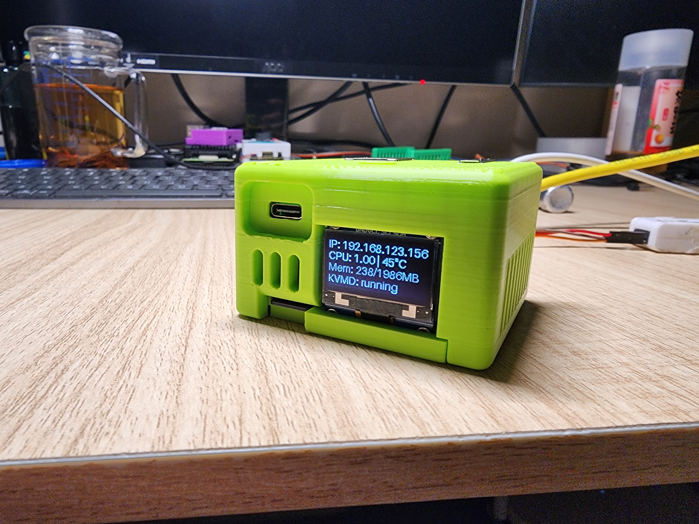
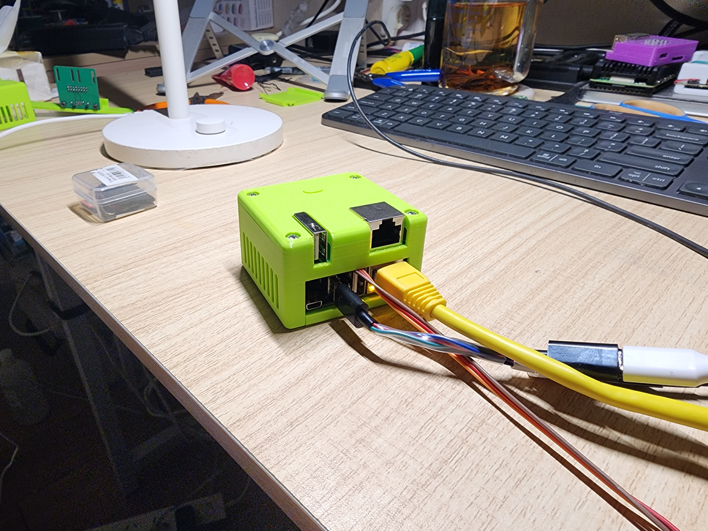
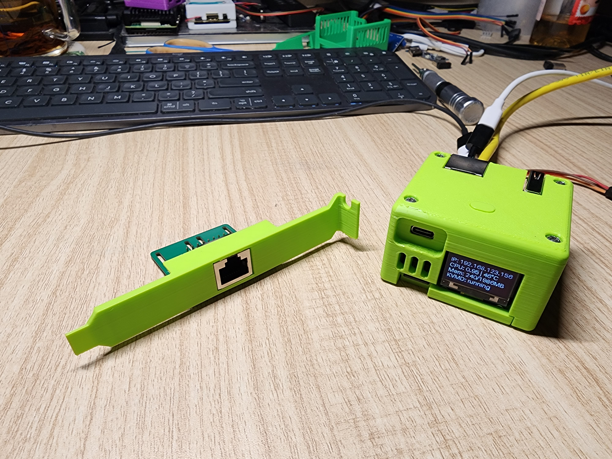
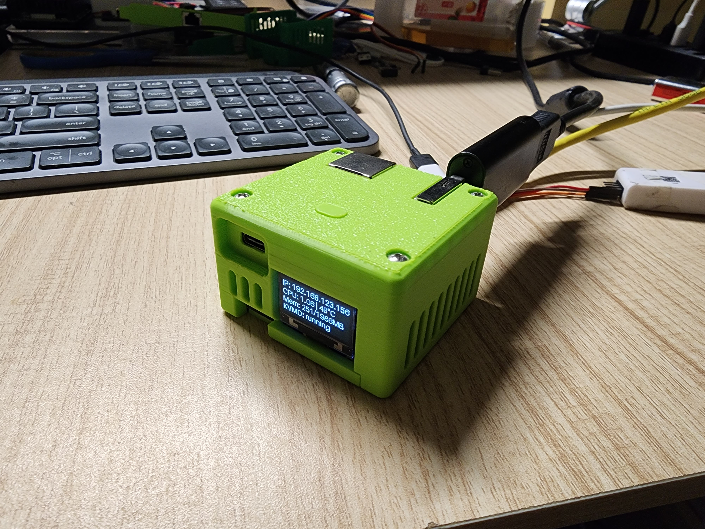
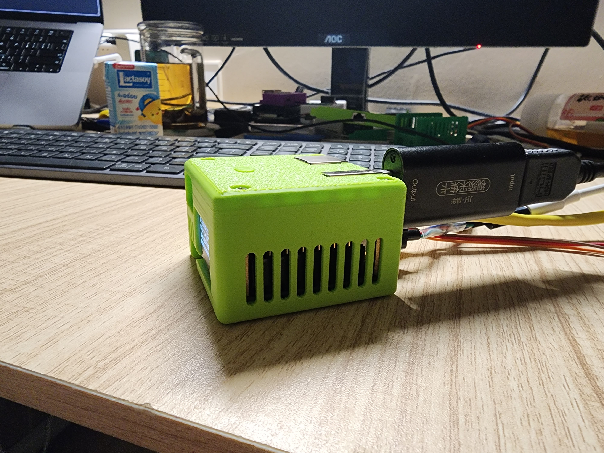
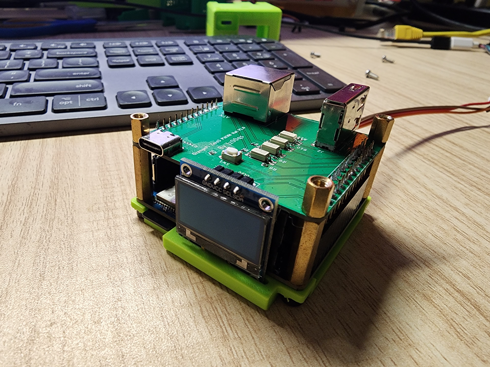
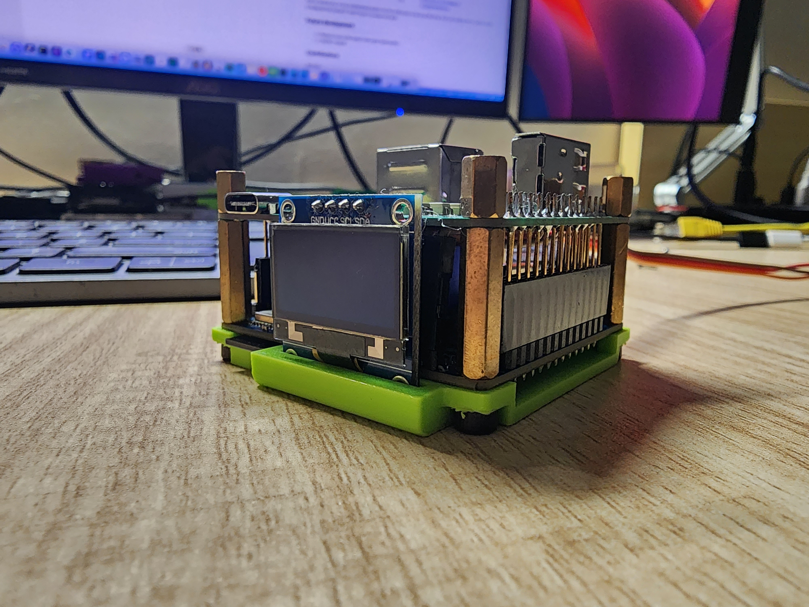
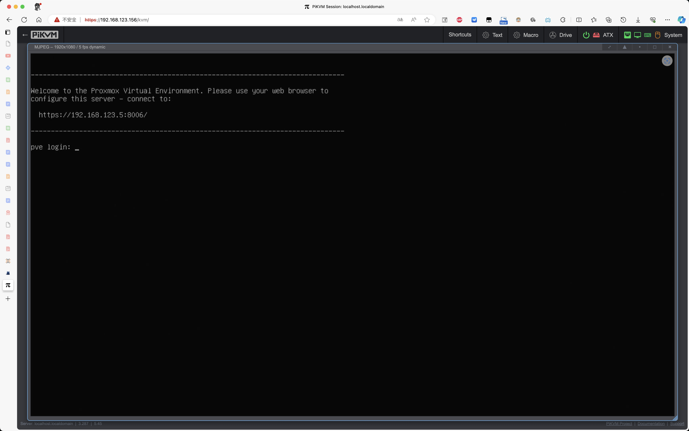

# orangepi-zero3-pikvm
## Intro
This is a pikvm port based on OrangePi Zero3 with a bom cost of less than 200 RMB.
You can learn about pikvm in their [official repo](https://github.com/pikvm/pikvm).

## What is working
- [x] KVMD basic PiKVM software package
- [x] USB video capture (MS2109, MS2130)
- [x] USB virtual keyboard and mouse
- [x] USB virtual massive storage
- [x] ATX power control
- [x] OLED module system info display
- [ ] WiFi/BT module is not working. Because of the use of a module(Cdtech 20U5622) from a small Chinese manufacturer, driver adaptation has not yet been achieved.

## How to make it
### Software
Not only can you download the image directly from releases, but you can also use this [repo](https://github.com/lz00qs/orangepi-zero3-pikvm-builder) to build a flashable image yourself.
Then use the balenaetcher or dd to burn the image to the TF card.
* Default root password is `root`
* Default web user is `admin` and default web user password is `admin` 

### Hardware
See this [repo](https://github.com/lz00qs/orangepi-zero3-pikvm-hardware) to get all the PCB and printable 3D models.

#### Bom List
| Name | Reference | Quantity | Price(RMB) | Source | Comment |
|  ----  |  ----  |  ----  |  ----  |  ----  |  ----  |
| Orange Pi Zero 3 | | 1 | 99 | Taobao | |
| MS2109 USB capture device | | 1 | 40 | Taobao or PDD | |
| PCB | | 2 | 0 | JLC | |
| 100nF 50V 0603 MLCC | C1, C2 | 2 | 0.02 | Taobao | |
| 5.1K 0402 SMD Resistor | R1, R2, R3, R4 | 4 | 0.04 | Taobao | Optional |
| 390R 0603 SMD Resistor | R6, R7, R10, R11 | 4 | 0.04 | Taobao | |
| 4.7K 0603 SMD Resistor | R5, R8, R9 | 3 | 0.03 | Taobao | |
| PC817 D | U2, U3, U4, U5 | 4 | 1 | https://m.tb.cn/h.5m018x0?tk=wWXCWUWYeob | |
| 0.96 4P I2C OLED module | U1 | 1 | 11 | https://m.tb.cn/h.5Ni8Any?tk=ZwRDWUWd1Qu | |
| 2.54mm 4P right angle male pin header | U1 | 1 | 0.2 | https://m.tb.cn/h.5NihHx0?tk=3yC1WUW0FfO | |
| 3\*4\*2.5mm microswitch | SW1 | 1 | 0.1 | https://m.tb.cn/h.5Ni6tgu?tk=LWpUWUW043V | |
| Type-C Receptacle 16P | J1 | 1 | 0.23 | https://m.tb.cn/h.5NinDM6?tk=NU4hWUWgiCD | |
| Type-A Vertical Receptacle | J2 | 1 | 0.16 | https://m.tb.cn/h.5m0bfEF?tk=G7vhWUWZfht | |
| RJ45 Type-56 8P8C | J5 | 2 | 1.24 | https://m.tb.cn/h.5m0YUV9?tk=XWUtWUWb88y | |
| 2.54mm long female pin header | J3, J4 | 2 | 2.4 | https://m.tb.cn/h.5O8BeLZ?tk=q95VWUWbwag | |
| 9\*9\*12mm heat sink | | 1 | 0.24 | https://m.tb.cn/h.5N9Ct6C?tk=nHeyWUfloAR | |
| M3\*7mm double-pass copper pillars | | 4 | 0.36 | https://m.tb.cn/h.5mqMExZ?tk=1JN4WUfn6Bn | |
| M3\*18+3mm single-pass copper pillars | | 4 | 1.12 | https://m.tb.cn/h.5Ol91ZI?tk=To4rWUfojZ8 | |
| M3\*8mm hexagon socket head cap screws | | 8 | 0.24 | https://m.tb.cn/h.5Ol9HSJ?tk=swUkWUfprV5 | |

Notice that if your motherboard doesn't set the USB power to be on all the time, then you need to DIY a Type-C cable to separate the Orange Pi Zero3 Type-C's power and data.

## Future development
- [ ] Replace copy build system with patch build system
- [ ] WiFi/BT module

## Contributions

@lz00qs

## License

GPL V3.0
